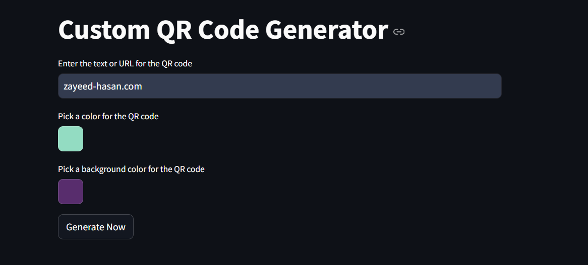

---

# Custom QR Code Generator

## Overview

Welcome to the **Custom QR Code Generator**! This application allows you to generate custom QR codes with various colors and background options using Streamlit. You can input text or URLs, select colors for your QR code and background, and then download the generated QR code as a PNG image.

## Features

- **Text or URL Input**: Enter the text or URL you want to encode in the QR code.
- **Custom Colors**: Choose colors for the QR code and its background using color pickers.
- **Download Option**: Generate and download the QR code image in PNG format.
- **Real-time Preview**: See a preview of the QR code before downloading.

## Screenshots

Here are some examples of what you can achieve with the Custom QR Code Generator:

<div style="display: flex; gap: 10px; justify-content: center;">
 


 
</div>



## Installation

To run the Custom QR Code Generator locally, you need to have Python installed on your machine. Follow these steps:

1. **Clone the Repository**:

   ```bash
   git clone https://github.com/zhrafin/QR-Code-Generator.git
   cd QR-Code-Generator
   ```

2. **Create a Virtual Environment** (recommended):

   ```bash
   python -m venv venv
   source venv/bin/activate  # On Windows use: venv\Scripts\activate
   ```

3. **Install Dependencies**:

   ```bash
   pip install -r requirements.txt
   ```

4. **Run the Application**:

   ```bash
   streamlit run app.py
   ```

5. **Open in Browser**: After running the above command, your default browser should open with the application. If not, navigate to `http://localhost:8501` to view it.

## Usage

1. **Enter Text or URL**: Type in the text or URL that you want to encode into the QR code.
2. **Pick Colors**: Use the color pickers to choose your desired colors for the QR code and its background.
3. **Generate QR Code**: Click the "Generate Now" button to create your QR code.
4. **Preview and Download**: See the QR code preview and click the "Download QR code" button to save the image to your device.

## Requirements

Ensure you have the following Python packages installed:

- `streamlit==1.21.0`
- `qrcode==7.3.1`
- `Pillow==10.0.0`

These dependencies are listed in the `requirements.txt` file.

## Contributing

If you'd like to contribute to this project, please follow these steps:

1. Fork the repository.
2. Create a new branch (`git checkout -b feature/your-feature`).
3. Make your changes and commit them (`git commit -am 'Add new feature'`).
4. Push to the branch (`git push origin feature/your-feature`).
5. Create a new Pull Request.
